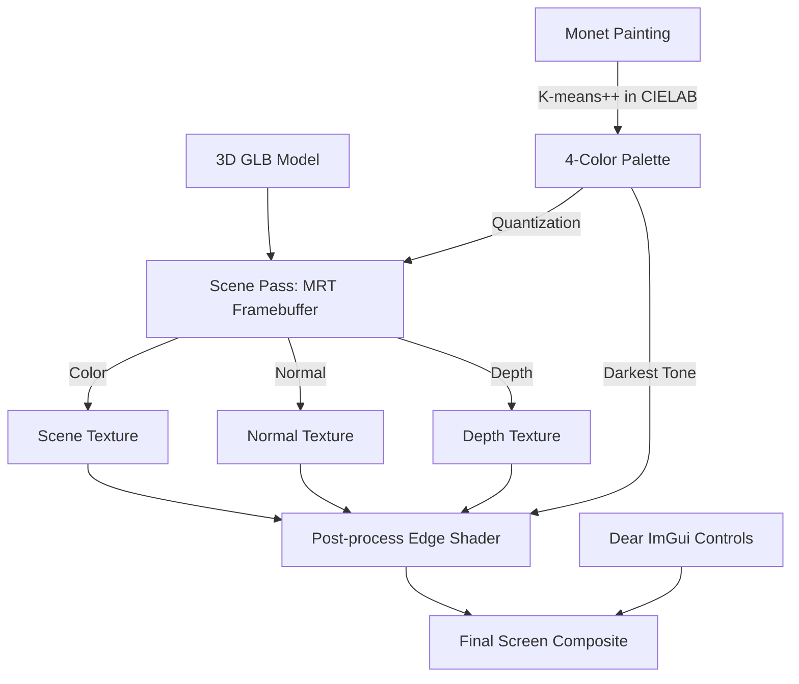

# 3D Stylized NPR Renderer with Impressionist Palette & G-Buffer Linework

인상주의 회화(클로드 모네의 루앙 대성당 연작)의 색채 팔레트를 추출하여 3D 모델에 적용하는 실시간 비사실적 렌더링(NPR, Non-Photorealistic Rendering) 프로젝트입니다.

---

## 📌 주요 기능 (Key Features)

1. **CIELAB 기반 K-means++ 대표 색상 추출 (Palette Extraction)**
   - 클로드 모네의 <루앙 대성당> 5개 연작(Grey Weather, Noon, Sunset, Morning Light, Sunlight) 중 하나를 선택하면 대표 색상 4가지를 실시간으로 추출합니다.
   - **K-means++ 초기화**: 색상 간 거리 확률에 비례하여 초기 클러스터 중심을 선정하여 수렴 속도 및 품질을 향상시켰습니다.
   - **CIELAB 색공간 계산**: 인간의 시각 인지 특성을 반영하는 $L^*a^*b^*$ 색공간에서 유클리드 거리를 측정하여 자연스러운 팔레트를 생성합니다.

2. **팔레트 양자화 카툰 렌더링 (Toon Shading with Palette Quantization)**
   - 3단계 계단식 Diffuse 라이팅으로 음영을 계산합니다.
   - 조명 처리된 표면 색상을 추출된 4가지 팔레트 색상 중 가장 가까운 색상으로 양자화(Quantization)하여 회화적 느낌의 카툰 스타일을 구현합니다.
   - 확대된 역방향 메시를 이용한 1차 외곽선(Inverted Hull Outline)을 지원합니다.

3. **G-buffer 기반 엣지 검출 및 라인워크 합성 (G-Buffer Linework Post-processing)**
   - 별도의 FBO(Framebuffer Object)에 색상(Albedo), 뷰 공간 법선(Normal), 깊이(Depth)를 다중 렌더 타깃(MRT)으로 기록합니다.
   - 후처리 셰이더(`gbuffer_edge.frag`)에서 이웃 픽셀과의 법선 내적 변화 및 깊이 불연속성을 검출하여 정밀하고 카툰 스타일에 적합한 라인워크를 생성합니다.
   - 추출된 팔레트의 최암부 색상을 가공하여 외곽선 색상으로 자동 적용합니다.

4. **인터랙티브 UI 및 제어 (Interactive UI & Controls)**
   - **Dear ImGui** 컨트롤 패널 지원:
     - 5가지 모네 그림 선택 버튼 및 현재 선택 상태 표시
     - 추출된 4색 클러스터 스와치 오버레이
     - `G-buffer Linework` ON/OFF 토글
     - `Line Width (px)`: 엣지 검출 반경 조절 (1 ~ 4 px)
     - `Reset Camera`: 카메라 위치, 팔레트(#000000), 렌더링 모드 초기화
   - **Virtual Trackball**: 좌클릭(회전), 휠/우클릭(줌), 휠클릭/Ctrl+좌클릭(팬)을 통한 3D 내비게이션

---

## 🛠 시스템 아키텍처 및 렌더링 파이프라인



---

## 💻 빌드 및 실행 환경 (Requirements & Build)

- **OS**: Windows (x86 / x64)
- **IDE / Build Tools**: Visual Studio 2019 / 2022 (MSBuild, PlatformToolset v145 또는 v142/v143)
- **Dependencies**:
  - OpenGL 3.3 Core Profile / GLAD
  - GLFW 3
  - Dear ImGui
  - TinyGLTF & stb_image

### Visual Studio 솔루션 빌드
```powershell
MSBuild .\gl-03-transform\src\cgtrackball.sln /t:Build /p:Configuration=Release /p:Platform=Win32
```
빌드 후 `gl-03-transform/bin/cgtrackball.exe`가 생성 및 실행됩니다.
